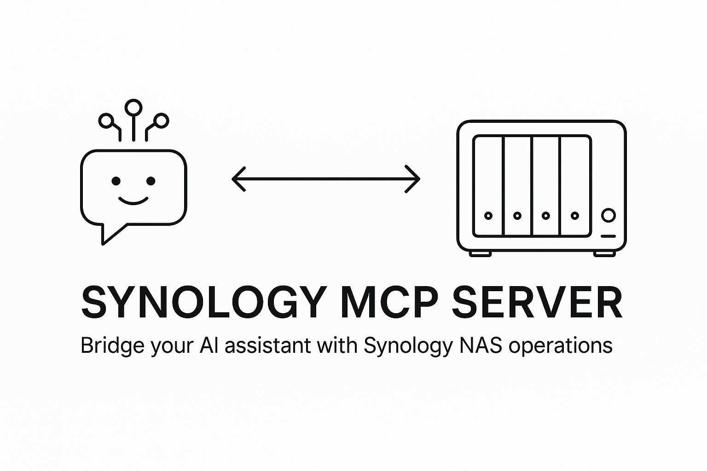
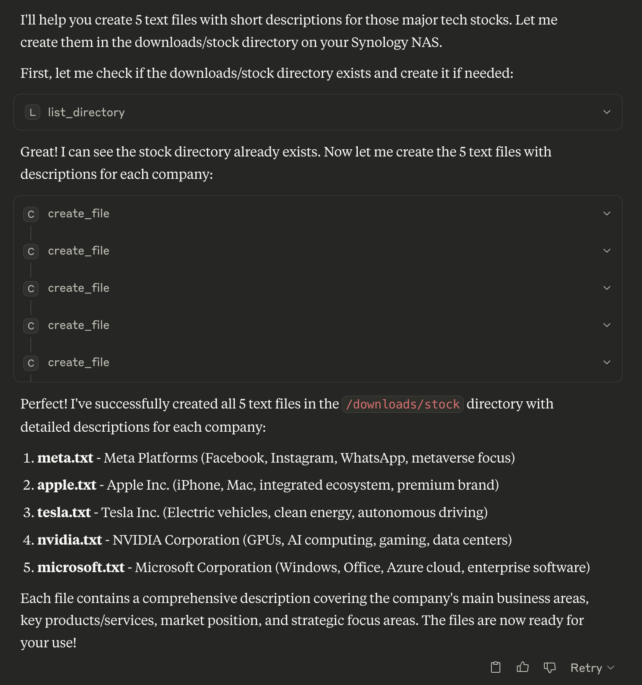
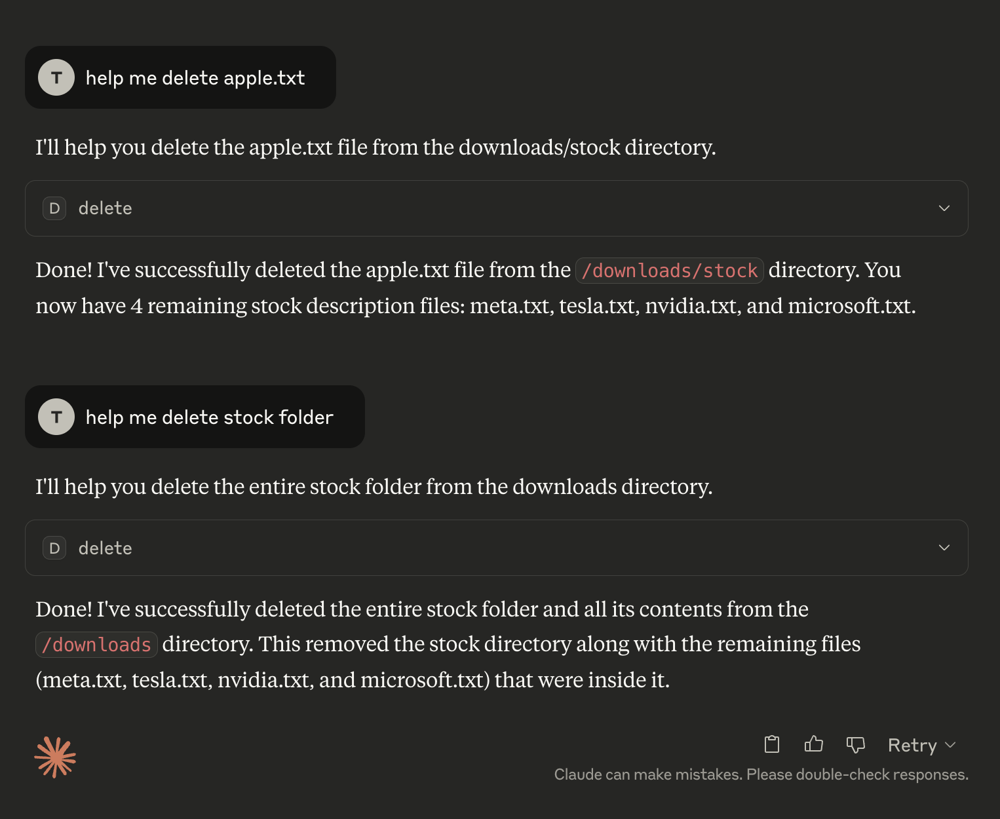
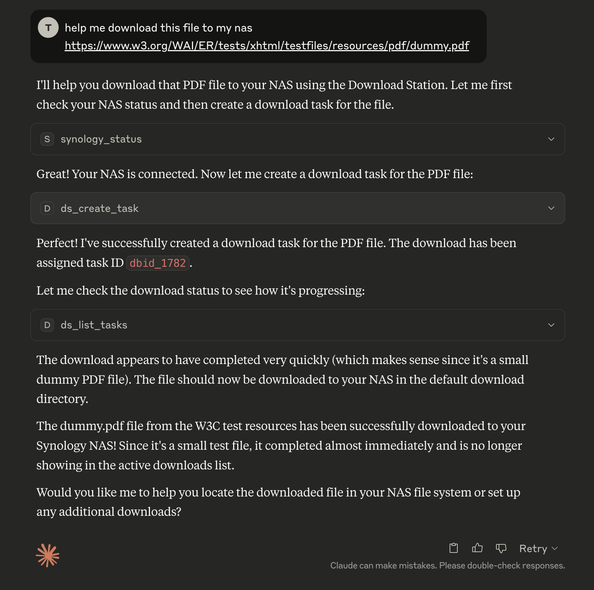
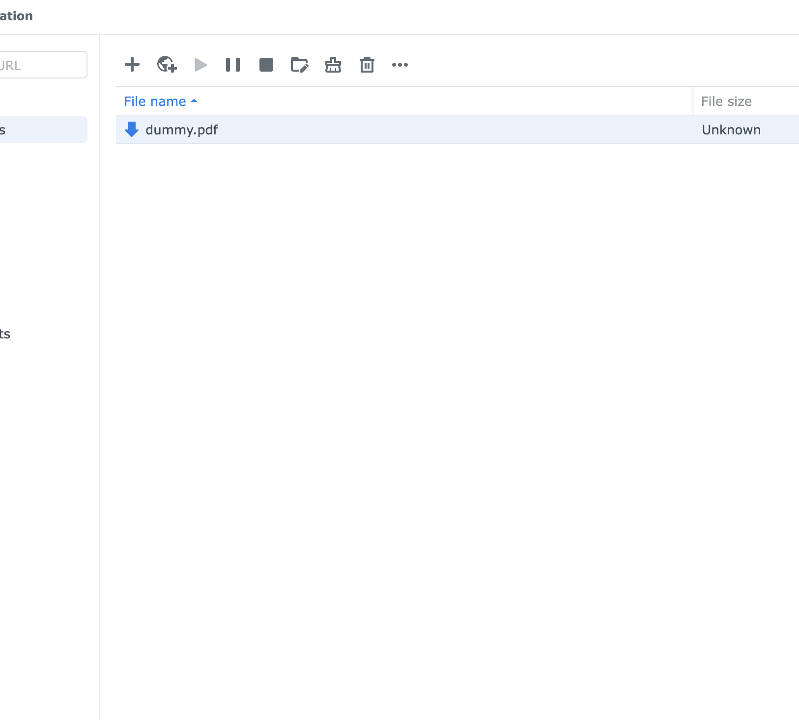

# 🏠 Synology MCP Server



A Model Context Protocol (MCP) server for Synology NAS devices. Enables AI assistants to manage files and downloads through secure authentication and session management.

## 🚀 Quick Start with Docker

### 1️⃣ Setup Environment
```bash
# Clone repository
git clone https://github.com/atom2ueki/mcp-server-synology.git
cd mcp-server-synology

# Create environment file
cp env.example .env
```

### 2️⃣ Configure .env File
```bash
# Required: Synology NAS connection
SYNOLOGY_URL=http://192.168.1.100:5000
SYNOLOGY_USERNAME=your_username
SYNOLOGY_PASSWORD=your_password

# Optional: Auto-login on startup
AUTO_LOGIN=true
VERIFY_SSL=false
```

### 3️⃣ Run with Docker
```bash
# Build and run
docker-compose up --build

# Most of the case you run detached
docker-compose up -d --build
```

### 4️⃣ Alternative: Docker Run
```bash
# Build image
docker build -t synology-mcp-server .

# Run container
docker run --env-file .env synology-mcp-server
```

## 🔌 MCP Client Setup

### 🤖 Claude Desktop

Add to your Claude Desktop configuration file:

**macOS:** `~/Library/Application Support/Claude/claude_desktop_config.json`
**Windows:** `%APPDATA%\Claude\claude_desktop_config.json`

```json
{
  "mcpServers": {
    "synology": {
      "command": "docker-compose",
      "args": [
        "-f", "/path/to/your/mcp-server-synology/docker-compose.yml",
        "run", "--rm", "synology-mcp"
      ],
      "cwd": "/path/to/your/mcp-server-synology"
    }
  }
}
```

### 🔄 Continue (VS Code Extension)

Add to your Continue configuration (`.continue/config.json`):

```json
{
  "mcpServers": {
    "synology": {
      "command": "docker-compose",
      "args": [
        "-f", "/path/to/your/mcp-server-synology/docker-compose.yml",
        "run", "--rm", "synology-mcp"
      ],
      "cwd": "/path/to/your/mcp-server-synology"
    }
  }
}
```

### ↗️ Cursor

Add to your Cursor MCP settings:

```json
{
  "mcpServers": {
    "synology": {
      "command": "docker-compose",
      "args": [
        "-f", "/path/to/your/mcp-server-synology/docker-compose.yml",
        "run", "--rm", "synology-mcp"
      ],
      "cwd": "/path/to/your/mcp-server-synology"
    }
  }
}
```

### 💻 Codeium

For Codeium's MCP support:

```json
{
  "mcpServers": {
    "synology": {
      "command": "docker-compose",
      "args": [
        "-f", "/path/to/your/mcp-server-synology/docker-compose.yml",
        "run", "--rm", "synology-mcp"
      ],
      "cwd": "/path/to/your/mcp-server-synology"
    }
  }
}
```

### 🐍 Alternative: Direct Python Execution

If you prefer not to use Docker, you can run the server directly:

```json
{
  "mcpServers": {
    "synology": {
      "command": "python",
      "args": ["main.py"],
      "cwd": "/path/to/your/mcp-server-synology",
      "env": {
        "SYNOLOGY_URL": "http://192.168.1.100:5000",
        "SYNOLOGY_USERNAME": "your_username",
        "SYNOLOGY_PASSWORD": "your_password",
        "AUTO_LOGIN": "true"
      }
    }
  }
}
```

## 💻 Local Development Setup

```bash
# Install dependencies
pip install -r requirements.txt

# Run directly
python main.py
```

## 🛠️ Available MCP Tools

### 🔐 Authentication
- **`synology_status`** - Check authentication status and active sessions
- **`synology_login`** - Authenticate with Synology NAS *(conditional)*
- **`synology_logout`** - Logout from session *(conditional)*

### 📁 File System Operations
- **`list_shares`** - List all available NAS shares
- **`list_directory`** - List directory contents with metadata
  - `path` (required): Directory path starting with `/`
- **`get_file_info`** - Get detailed file/directory information
  - `path` (required): File path starting with `/`
- **`search_files`** - Search files matching pattern
  - `path` (required): Search directory
  - `pattern` (required): Search pattern (e.g., `*.pdf`)
- **`create_file`** - Create new files with content
  - `path` (required): Full file path starting with `/`
  - `content` (optional): File content (default: empty string)
  - `overwrite` (optional): Overwrite existing files (default: false)
- **`create_directory`** - Create new directories
  - `folder_path` (required): Parent directory path starting with `/`
  - `name` (required): New directory name
  - `force_parent` (optional): Create parent directories if needed (default: false)
- **`delete`** - Delete files or directories (auto-detects type)
  - `path` (required): File/directory path starting with `/`
- **`rename_file`** - Rename files or directories
  - `path` (required): Current file path
  - `new_name` (required): New filename
- **`move_file`** - Move files to new location
  - `source_path` (required): Source file path
  - `destination_path` (required): Destination path
  - `overwrite` (optional): Overwrite existing files

### 📥 Download Station Management
- **`ds_get_info`** - Get Download Station information
- **`ds_list_tasks`** - List all download tasks with status
  - `offset` (optional): Pagination offset
  - `limit` (optional): Max tasks to return
- **`ds_create_task`** - Create new download task
  - `uri` (required): Download URL or magnet link
  - `destination` (optional): Download folder path
- **`ds_pause_tasks`** - Pause download tasks
  - `task_ids` (required): Array of task IDs
- **`ds_resume_tasks`** - Resume paused tasks
  - `task_ids` (required): Array of task IDs  
- **`ds_delete_tasks`** - Delete download tasks
  - `task_ids` (required): Array of task IDs
  - `force_complete` (optional): Force delete completed
- **`ds_get_statistics`** - Get download/upload statistics

## ⚙️ Configuration Options

| Variable | Required | Default | Description |
|----------|----------|---------|-------------|
| `SYNOLOGY_URL` | Yes* | - | NAS base URL (e.g., `http://192.168.1.100:5000`) |
| `SYNOLOGY_USERNAME` | Yes* | - | Username for authentication |
| `SYNOLOGY_PASSWORD` | Yes* | - | Password for authentication |
| `AUTO_LOGIN` | No | `true` | Auto-login on server start |
| `VERIFY_SSL` | No | `true` | Verify SSL certificates |
| `DEBUG` | No | `false` | Enable debug logging |

*Required for auto-login and default operations

## 📖 Usage Examples

### 📁 File Operations

#### ✅ Creating Files and Directories


```json
// List directory
{
  "path": "/volume1/homes"
}

// Search for PDFs
{
  "path": "/volume1/documents", 
  "pattern": "*.pdf"
}

// Create new file
{
  "path": "/volume1/documents/notes.txt",
  "content": "My important notes\nLine 2 of notes",
  "overwrite": false
}
```

#### 🗑️ Deleting Files and Directories


```json
// Delete file or directory (auto-detects type)
{
  "path": "/volume1/temp/old-file.txt"
}

// Move file
{
  "source_path": "/volume1/temp/file.txt",
  "destination_path": "/volume1/archive/file.txt"
}
```

### ⬇️ Download Management

#### 🛠️ Creating a Download Task


```json
// Create download task
{
  "uri": "https://example.com/file.zip",
  "destination": "/volume1/downloads"
}

// Pause tasks
{
  "task_ids": ["dbid_123", "dbid_456"]
}
```

#### 🦦 Download Results


## ✨ Features

- ✅ **Secure Authentication** - RSA encrypted password transmission
- ✅ **Session Management** - Persistent sessions across multiple NAS devices  
- ✅ **Complete File Operations** - Create, delete, list, search, rename, move files with detailed metadata
- ✅ **Directory Management** - Recursive directory operations with safety checks
- ✅ **Download Station** - Complete torrent and download management
- ✅ **Docker Support** - Easy containerized deployment
- ✅ **Multi-Client Support** - Works with Claude, Continue, Cursor, Codeium and more
- ✅ **Error Handling** - Comprehensive error reporting and recovery 