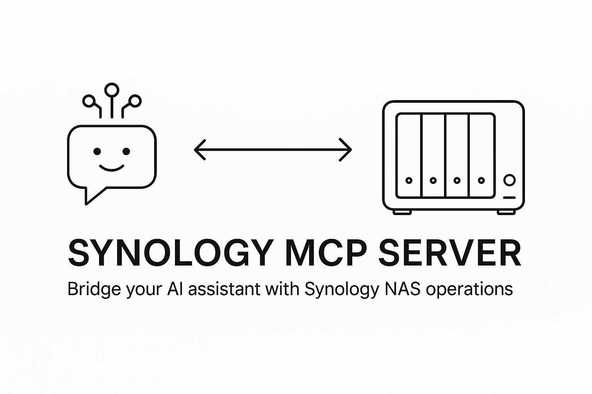
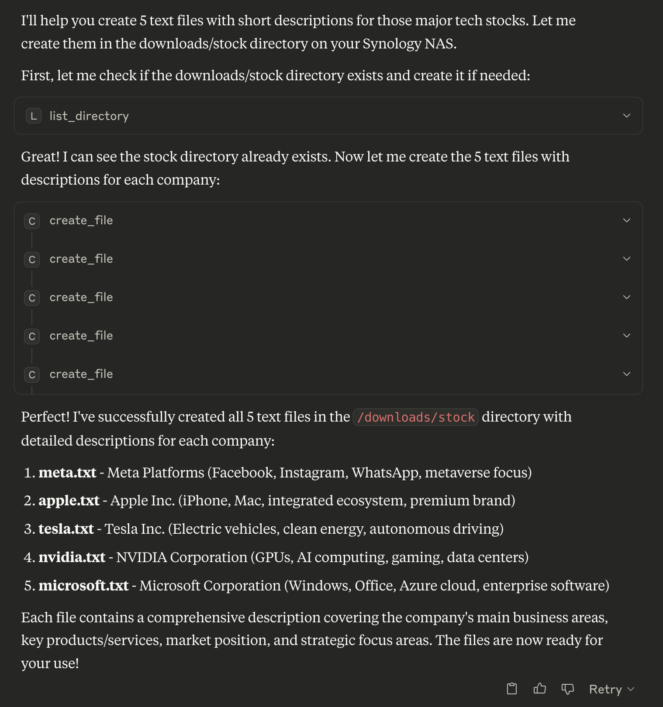
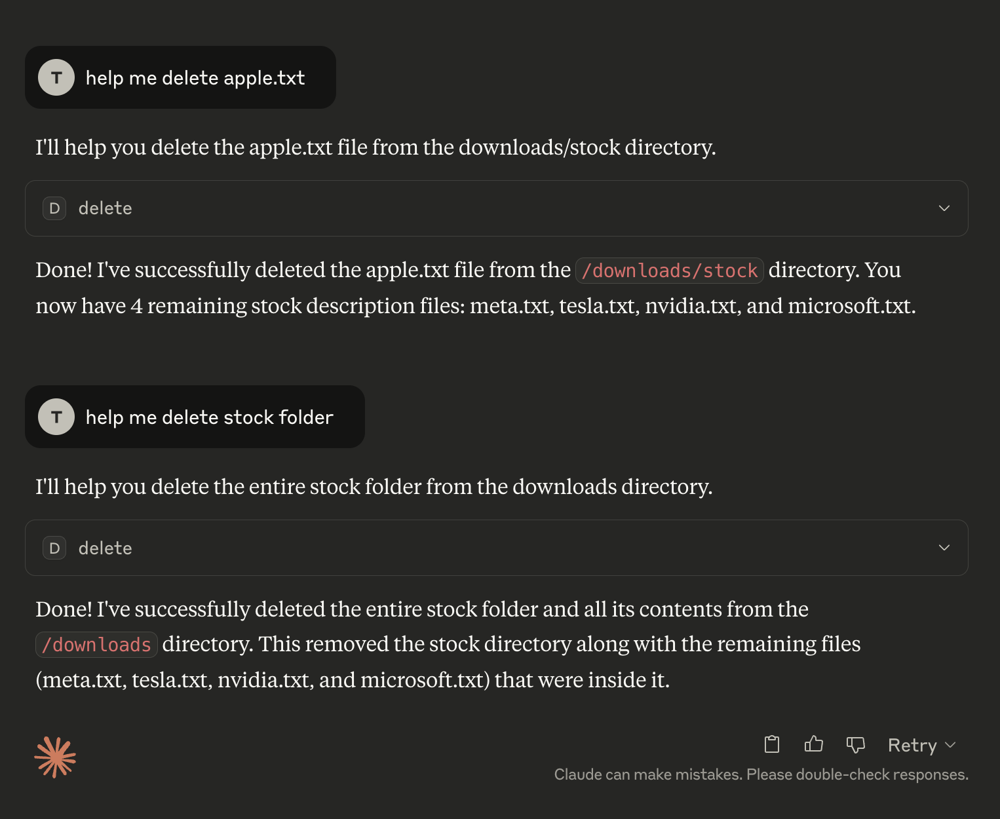
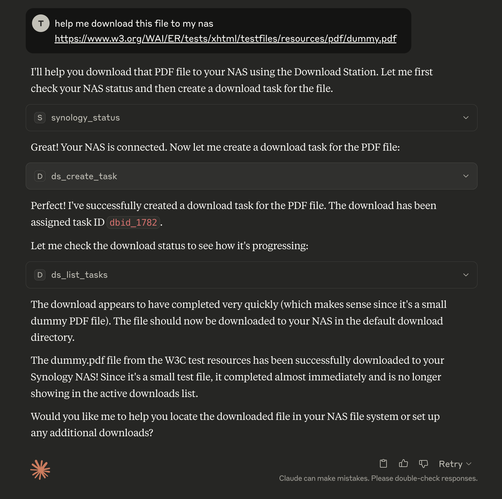
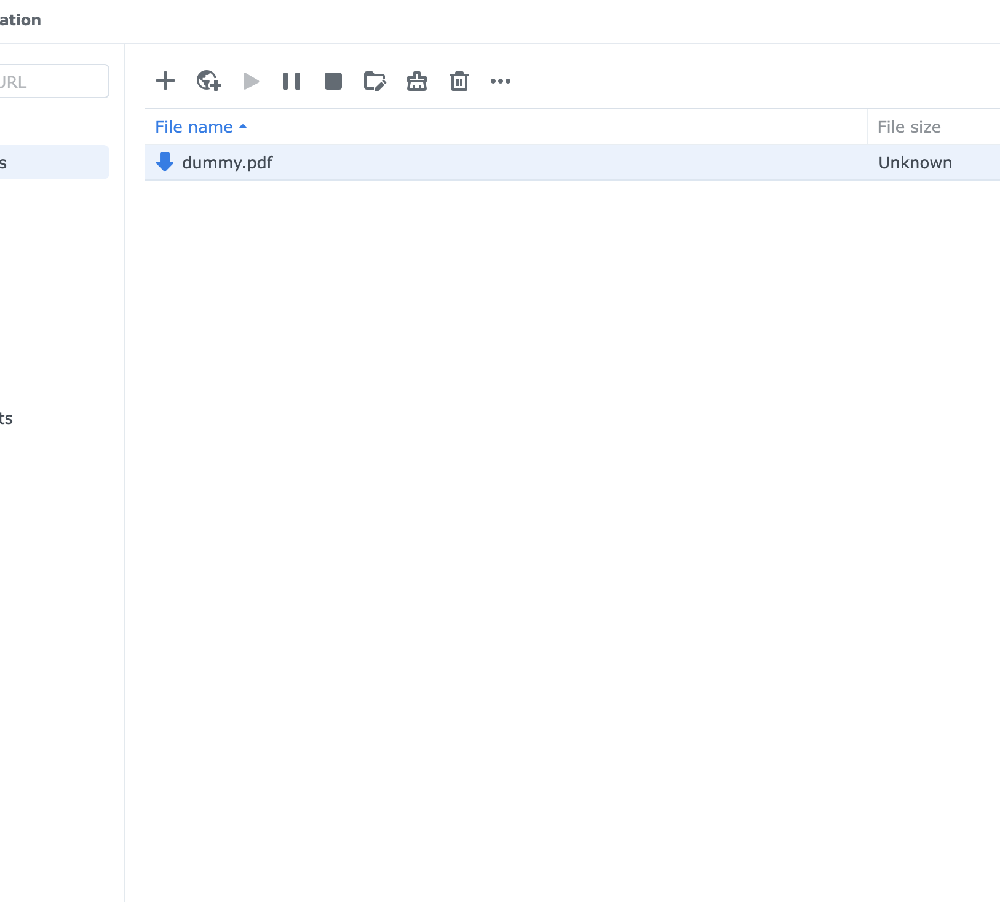

# 💾 Synology MCP Server



A Model Context Protocol (MCP) server for Synology NAS devices. Enables AI assistants to manage files and downloads through secure authentication and session management.

**🌟 NEW: Unified server supports both Claude/Cursor (stdio) and Xiaozhi (WebSocket) simultaneously!**

## 🚀 Quick Start with Docker

### 1️⃣ Setup Environment
```bash
# Clone repository
git clone https://github.com/atom2ueki/mcp-server-synology.git
cd mcp-server-synology

# Create environment file
cp env.example .env
```

### 2️⃣ Configure .env File

**Basic Configuration (Claude/Cursor only):**
```bash
# Required: Synology NAS connection
SYNOLOGY_URL=http://192.168.1.100:5000
SYNOLOGY_USERNAME=your_username
SYNOLOGY_PASSWORD=your_password

# Optional: Auto-login on startup
AUTO_LOGIN=true
VERIFY_SSL=false
```

**Extended Configuration (Both Claude/Cursor + Xiaozhi):**
```bash
# Required: Synology NAS connection
SYNOLOGY_URL=http://192.168.1.100:5000
SYNOLOGY_USERNAME=your_username
SYNOLOGY_PASSWORD=your_password

# Optional: Auto-login on startup
AUTO_LOGIN=true
VERIFY_SSL=false

# Enable Xiaozhi support
ENABLE_XIAOZHI=true
XIAOZHI_TOKEN=your_xiaozhi_token_here
XIAOZHI_MCP_ENDPOINT=wss://api.xiaozhi.me/mcp/
```

### 3️⃣ Run with Docker

**One simple command supports both modes:**

```bash
# Claude/Cursor only mode (default if ENABLE_XIAOZHI not set)
docker-compose up -d

# Both Claude/Cursor + Xiaozhi mode (if ENABLE_XIAOZHI=true in .env)
docker-compose up -d

# Build and run
docker-compose up -d --build
```

### 4️⃣ Alternative: Local Python

```bash
# Install dependencies
pip install -r requirements.txt

# Run with environment control
python main.py
```

## 🔌 Client Setup

### 🤖 Claude Desktop

Add to your Claude Desktop configuration file:

**macOS:** `~/Library/Application Support/Claude/claude_desktop_config.json`
**Windows:** `%APPDATA%\Claude\claude_desktop_config.json`

```json
{
  "mcpServers": {
    "synology": {
      "command": "docker-compose",
      "args": [
        "-f", "/path/to/your/mcp-server-synology/docker-compose.yml",
        "run", "--rm", "synology-mcp"
      ],
      "cwd": "/path/to/your/mcp-server-synology"
    }
  }
}
```

### ↗️ Cursor

Add to your Cursor MCP settings:

```json
{
  "mcpServers": {
    "synology": {
      "command": "docker-compose",
      "args": [
        "-f", "/path/to/your/mcp-server-synology/docker-compose.yml",
        "run", "--rm", "synology-mcp"
      ],
      "cwd": "/path/to/your/mcp-server-synology"
    }
  }
}
```

### 🔄 Continue (VS Code Extension)

Add to your Continue configuration (`.continue/config.json`):

```json
{
  "mcpServers": {
    "synology": {
      "command": "docker-compose",
      "args": [
        "-f", "/path/to/your/mcp-server-synology/docker-compose.yml",
        "run", "--rm", "synology-mcp"
      ],
      "cwd": "/path/to/your/mcp-server-synology"
    }
  }
}
```

### 💻 Codeium

For Codeium's MCP support:

```json
{
  "mcpServers": {
    "synology": {
      "command": "docker-compose",
      "args": [
        "-f", "/path/to/your/mcp-server-synology/docker-compose.yml",
        "run", "--rm", "synology-mcp"
      ],
      "cwd": "/path/to/your/mcp-server-synology"
    }
  }
}
```

### 🐍 Alternative: Direct Python Execution

If you prefer not to use Docker:

```json
{
  "mcpServers": {
    "synology": {
      "command": "python",
      "args": ["main.py"],
      "cwd": "/path/to/your/mcp-server-synology",
      "env": {
        "SYNOLOGY_URL": "http://192.168.1.100:5000",
        "SYNOLOGY_USERNAME": "your_username",
        "SYNOLOGY_PASSWORD": "your_password",
        "AUTO_LOGIN": "true",
        "ENABLE_XIAOZHI": "false"
      }
    }
  }
}
```

## 🌟 Xiaozhi Integration

**New unified architecture supports both clients simultaneously!**

### How It Works

- **ENABLE_XIAOZHI=false** (default): Standard MCP server for Claude/Cursor via stdio
- **ENABLE_XIAOZHI=true**: Multi-client bridge supporting both:
  - 📡 **Xiaozhi**: WebSocket connection
  - 💻 **Claude/Cursor**: stdio connection

### Setup Steps

1. **Add to your .env file:**
```bash
ENABLE_XIAOZHI=true
XIAOZHI_TOKEN=your_xiaozhi_token_here
```

2. **Run normally:**
```bash
# Same command, different behavior based on environment
python main.py
# OR
docker-compose up
```

### Key Features
- ✅ **Zero Configuration Conflicts**: One server, multiple clients
- ✅ **Parallel Operation**: Both clients can work simultaneously  
- ✅ **All Tools Available**: Xiaozhi gets access to all Synology MCP tools
- ✅ **Backward Compatible**: Existing setups work unchanged
- ✅ **Auto-Reconnection**: Handles WebSocket connection drops
- ✅ **Environment Controlled**: Simple boolean flag to enable/disable

### Startup Messages

**Claude/Cursor only mode:**
```
🚀 Synology MCP Server
==============================
📌 Claude/Cursor only mode (ENABLE_XIAOZHI=false)
```

**Both clients mode:**
```
🚀 Synology MCP Server with Xiaozhi Bridge
==================================================
🌟 Supports BOTH Xiaozhi and Claude/Cursor simultaneously!
```

## 🛠️ Available MCP Tools

### 🔐 Authentication
- **`synology_status`** - Check authentication status and active sessions
- **`synology_list_nas`** - List all configured NAS units from settings.json
- **`synology_login`** - Authenticate with Synology NAS *(conditional)*
- **`synology_logout`** - Logout from session *(conditional)*

### 📁 File System Operations
- **`list_shares`** - List all available NAS shares
- **`list_directory`** - List directory contents with metadata
  - `path` (required): Directory path starting with `/`
- **`get_file_info`** - Get detailed file/directory information
  - `path` (required): File path starting with `/`
- **`search_files`** - Search files matching pattern
  - `path` (required): Search directory
  - `pattern` (required): Search pattern (e.g., `*.pdf`)
- **`create_file`** - Create new files with content
  - `path` (required): Full file path starting with `/`
  - `content` (optional): File content (default: empty string)
  - `overwrite` (optional): Overwrite existing files (default: false)
- **`create_directory`** - Create new directories
  - `folder_path` (required): Parent directory path starting with `/`
  - `name` (required): New directory name
  - `force_parent` (optional): Create parent directories if needed (default: false)
- **`delete`** - Delete files or directories (auto-detects type)
  - `path` (required): File/directory path starting with `/`
- **`rename_file`** - Rename files or directories
  - `path` (required): Current file path
  - `new_name` (required): New filename
- **`move_file`** - Move files to new location
  - `source_path` (required): Source file path
  - `destination_path` (required): Destination path
  - `overwrite` (optional): Overwrite existing files

### 📥 Download Station Management
- **`ds_get_info`** - Get Download Station information
- **`ds_list_tasks`** - List all download tasks with status
  - `offset` (optional): Pagination offset
  - `limit` (optional): Max tasks to return
- **`ds_create_task`** - Create new download task
  - `uri` (required): Download URL or magnet link
  - `destination` (optional): Download folder path
- **`ds_pause_tasks`** - Pause download tasks
  - `task_ids` (required): Array of task IDs
- **`ds_resume_tasks`** - Resume paused tasks
  - `task_ids` (required): Array of task IDs  
- **`ds_delete_tasks`** - Delete download tasks
  - `task_ids` (required): Array of task IDs
  - `force_complete` (optional): Force delete completed
- **`ds_get_statistics`** - Get download/upload statistics

### 🏥 Health Monitoring
- **`synology_system_info`** - Get system model, serial, DSM version, uptime, temperature
- **`synology_utilization`** - Get real-time CPU, memory, swap, and disk I/O utilization
- **`synology_disk_health`** - List all physical disks with SMART status, model, temp, size
- **`synology_disk_smart`** - Get detailed SMART attributes for a specific disk
- **`synology_volume_status`** - List all volumes with status, size, usage, filesystem type
- **`synology_storage_pool`** - List RAID/storage pools with level, status, member disks
- **`synology_network`** - Get network interface status and transfer rates
- **`synology_ups`** - Get UPS status, battery level, power readings
- **`synology_services`** - List installed packages and their running status
- **`synology_system_log`** - Get recent system log entries
- **`synology_health_summary`** - Aggregate system info, utilization, disk health, and volume status

### 📦 NFS Management
- **`synology_nfs_status`** - Get NFS service status and configuration
- **`synology_nfs_enable`** - Enable or disable the NFS service
- **`synology_nfs_list_shares`** - List all shared folders with their NFS permissions
- **`synology_nfs_set_permission`** - Set NFS client access permissions on a shared folder

## ⚙️ Configuration Options

> **⚠️ Security Warning: Use a Dedicated Account**
>
> For this MCP server, create a dedicated Synology user account with appropriate permissions. This account should:
> - **NOT have 2FA enabled** - The MCP server cannot handle 2FA prompts and will fail authentication
> - Have minimal required permissions only (not admin!)
> - Be used exclusively for MCP server automation
>
> Using your primary account with 2FA is dangerous - if auto-login fails, you may be locked out of your NAS!

### Using settings.json (Recommended)

| Variable | Required | Default | Description |
|----------|----------|---------|-------------|
| `SYNOLOGY_URL` | Yes* | - | NAS base URL (e.g., `http://192.168.1.100:5000`) |
| `SYNOLOGY_USERNAME` | Yes* | - | Username for authentication |
| `SYNOLOGY_PASSWORD` | Yes* | - | Password for authentication |
| `AUTO_LOGIN` | No | `true` | Auto-login on server start |
| `VERIFY_SSL` | No | `false` | Verify SSL certificates |
| `DEBUG` | No | `false` | Enable debug logging |
| `ENABLE_XIAOZHI` | No | `false` | Enable Xiaozhi WebSocket bridge |
| `XIAOZHI_TOKEN` | Xiaozhi only | - | Authentication token for Xiaozhi |
| `XIAOZHI_MCP_ENDPOINT` | No | `wss://api.xiaozhi.me/mcp/` | Xiaozhi WebSocket endpoint |

*Required for auto-login and default operations

### Using settings.json (Multi-NAS Support)

For managing multiple Synology NAS devices, use the XDG standard config directory (`~/.config/synology-mcp/settings.json`):

```bash
mkdir -p ~/.config/synology-mcp
touch ~/.config/synology-mcp/settings.json
chmod 600 ~/.config/synology-mcp/settings.json  # Important: secure permissions!
```

**Note:** This follows the [XDG Base Directory Specification](https://specifications.freedesktop.org/basedir-spec/basedir-spec-latest.html) - `~/.config/` is the standard location for user configuration files on Linux/macOS. You can customize the location by setting the `XDG_CONFIG_HOME` environment variable.

**With Docker:**
The docker-compose.yml automatically mounts your `~/.config/synology-mcp` directory into the container at `/home/mcpuser/.config/synology-mcp`, so multi-NAS works out of the box with Docker as well.

**settings.json format:**
```json
{
  "synology": {
    "nas1": {
      "host": "192.168.1.100",
      "port": 5000,
      "username": "admin",
      "password": "your_password",
      "note": "Primary NAS at home"
    },
    "nas2": {
      "host": "192.168.1.200",
      "port": 5001,
      "username": "admin",
      "password": "your_password",
      "note": "Backup NAS"
    }
  },
  "xiaozhi": {
    "enabled": false,
    "token": "your_xiaozhi_token",
    "endpoint": "wss://api.xiaozhi.me/mcp/"
  },
  "server": {
    "auto_login": true,
    "verify_ssl": false,
    "session_timeout": 3600,
    "debug": false,
    "log_level": "INFO"
  }
}
```

**Configuration fields:**
| Field | Required | Description |
|-------|----------|-------------|
| `host` | Yes | NAS hostname or IP address |
| `port` | No | API port (default: 5000 for HTTP, 5001 for HTTPS) |
| `username` | Yes | NAS username |
| `password` | Yes | NAS password |
| `note` | No | Optional description for your reference |

**Notes:**
- The server will use port 5001 (HTTPS) if port is 5001, otherwise defaults to HTTP (5000)
- File permissions: `chmod 600 ~/.config/synology-mcp/settings.json` is required for security
- The server will refuse to load settings if permissions are too open
- Both .env and settings.json can be used together (settings.json takes priority)

### ⚠️ Security Recommendations

**SSL Certificate Verification (VERIFY_SSL):**
- Default is `false` to support self-signed certificates on internal NAS devices
- **If your NAS has a valid SSL certificate (e.g., from Let's Encrypt or a corporate CA), set `VERIFY_SSL=true`**
- Setting `VERIFY_SSL=false` disables certificate verification and makes your connection vulnerable to man-in-the-middle (MITM) attacks
- Never disable SSL verification on untrusted networks

**Auto-Login (AUTO_LOGIN):**
- Default is `true` for convenience with settings.json
- Credentials are stored securely in `~/.config/synology-mcp/settings.json` with 0600 permissions
- If you prefer manual login, set `AUTO_LOGIN=false` and use the `synology_login` tool

## 📖 Usage Examples

### 📁 File Operations

#### ✅ Creating Files and Directories


```json
// List directory
{
  "path": "/volume1/homes"
}

// Search for PDFs
{
  "path": "/volume1/documents", 
  "pattern": "*.pdf"
}

// Create new file
{
  "path": "/volume1/documents/notes.txt",
  "content": "My important notes\nLine 2 of notes",
  "overwrite": false
}
```

#### 🗑️ Deleting Files and Directories


```json
// Delete file or directory (auto-detects type)
{
  "path": "/volume1/temp/old-file.txt"
}

// Move file
{
  "source_path": "/volume1/temp/file.txt",
  "destination_path": "/volume1/archive/file.txt"
}
```

### ⬇️ Download Management

#### 🛠️ Creating a Download Task


```json
// Create download task
{
  "uri": "https://example.com/file.zip",
  "destination": "/volume1/downloads"
}

// Pause tasks
{
  "task_ids": ["dbid_123", "dbid_456"]
}
```

#### 🦦 Download Results


## ✨ Features

- ✅ **Unified Entry Point** - Single `main.py` supports both stdio and WebSocket clients
- ✅ **Environment Controlled** - Switch modes via `ENABLE_XIAOZHI` environment variable
- ✅ **Multi-Client Support** - Simultaneous Claude/Cursor + Xiaozhi access
- ✅ **Secure Authentication** - RSA encrypted password transmission
- ✅ **Session Management** - Persistent sessions across multiple NAS devices  
- ✅ **Complete File Operations** - Create, delete, list, search, rename, move files with detailed metadata
- ✅ **Directory Management** - Recursive directory operations with safety checks
- ✅ **Download Station** - Complete torrent and download management
- ✅ **Docker Support** - Easy containerized deployment
- ✅ **Backward Compatible** - Existing configurations work unchanged
- ✅ **Error Handling** - Comprehensive error reporting and recovery

## 🏗️ Architecture

### File Structure
```
mcp-server-synology/
├── main.py                    # 🎯 Unified entry point
├── src/
│   ├── mcp_server.py         # Standard MCP server
│   ├── multiclient_bridge.py # Multi-client bridge
│   ├── auth/                 # Authentication modules
│   ├── filestation/          # File operations
│   └── downloadstation/      # Download management
├── docker-compose.yml        # Single service, environment-controlled
├── Dockerfile
├── requirements.txt
└── .env                      # Configuration
```

### Mode Selection
- **`ENABLE_XIAOZHI=false`** → `main.py` → `mcp_server.py` (stdio only)
- **`ENABLE_XIAOZHI=true`** → `main.py` → `multiclient_bridge.py` → `mcp_server.py` (both clients)

**Perfect for any workflow - from simple Claude/Cursor usage to advanced multi-client setups!** 🚀
